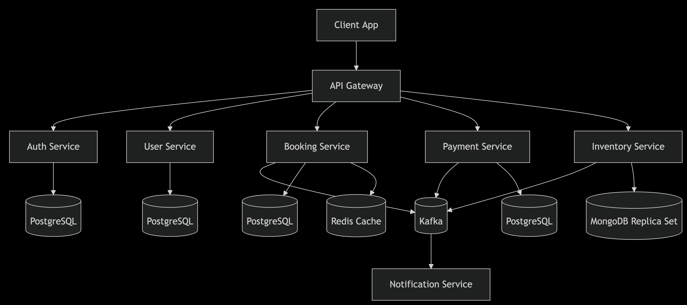

# Online Booking System: Flights, Hotels & Events

**Team**: Anastasiia Pelekh, Ksenia Kretsula, Andrii Ahitoliev.

> Make sure Java 17 is installed and that the `JAVA_HOME` environment variable is correctly set to its installation path.

## Quick Start

### Build and Run

```shell
rm -rf gradle
gradle wrapper --gradle-version 8.2
./gradlew clean build --stacktrace --info
```

### Smoke Tests

```shell
./smoke-test.sh
./smoke-test-auth.sh
```

## Debug Endpoints

List all users:
```shell
curl -X GET http://localhost:8085/auth/list-users
```

Delete all users:
```shell
curl -X DELETE http://localhost:8085/auth/delete-all-users
```

## System Overview

<table>
  <tr>
    <td style="vertical-align: top; width: 60%;">
      <p>
        The <strong>Online Booking System</strong> is a distributed microservices-based platform that enables users to book flights, hotel accommodations, and event tickets. The system provides a seamless experience for browsing available options, making reservations, processing payments, and receiving booking confirmations.
      </p>
    </td>
    <td style="text-align: center;">
      
    </td>
  </tr>
</table>

Key architectural features:

- Microservices architecture with bounded contexts
- Event-driven design using Kafka
- Saga pattern for distributed transactions
- Circuit breakers for fault tolerance
- Distributed tracing for observability
- Database per service pattern

## Core Services

### User Management

- **User Service**: Manages user profiles and personal information
- **Auth Service**: Handles authentication and authorization (JWT-based)

### Booking Flow

- **Booking Service**: Orchestrates the reservation process
- **Inventory Service**: Manages availability of seats/rooms/tickets
- **Payment Service**: Processes financial transactions

### Supporting Services

- **Notification Service**: Sends booking confirmations and updates
- **API Gateway**: Single entry point for client applications

## Technical Stack

| Component           | Technology                        |
|---------------------|-----------------------------------|
| API Gateway         | Spring Cloud Gateway              |
| Services Framework  | Spring Boot (Java)                |
| Auth                | Spring Security + JWT             |
| Messaging           | Apache Kafka                      |
| Databases           | PostgreSQL (SQL), MongoDB (NoSQL) |
| Caching             | Redis                             |
| Distributed Tracing | OpenTelemetry + Jaeger            |
| Monitoring          | Prometheus + Grafana              |
| CI/CD               | GitHub Actions                    |
| Containerization    | Docker + Kubernetes               |

## Key Architectural Patterns

1. **Saga Pattern**: Manages distributed transactions across Booking and Payment services
2. **Circuit Breaker**: Prevents cascading failures in Inventory Service
3. **CQRS**: Separates read and write operations for better scalability
4. **Event Sourcing**: Maintains audit trail of booking state changes
5. **Database per Service**: Ensures loose coupling between services

## System Architecture



## Product Features

### User Features

- User registration and authentication
- Browse available flights, hotels, and events
- Make reservations with seat/room selection
- Secure payment processing
- Booking confirmation and notifications
- View booking history

### Admin Features

- Inventory management (CRUD operations)
- Monitoring system health
- View booking analytics
- Manage user accounts

## Quality Attributes

1. **Reliability**: 99.9% uptime target with graceful degradation
2. **Scalability**: Horizontal scaling of stateless services
3. **Performance**: <2s response time for 95% of requests
4. **Security**: OAuth2, JWT, and data encryption
5. **Maintainability**: Clean architecture with good test coverage

## Getting Started

### Prerequisites

- Docker 20.10+
- Java 17
- Kafka 3.0+
- PostgreSQL 14+
- MongoDB 5.0+

## Testing Strategy

### Unit Testing

- 80% code coverage minimum per service
- Mock external dependencies

### Integration Testing

- Test service interactions
- Verify Kafka message flows
- Test database operations

### End-to-End Testing

- Test the complete booking flow
- Verify payment processing
- Check notification delivery

### Resilience Testing

- Service failure scenarios
- Network partition tests
- Load testing with Locust

## Monitoring and Observability

The system includes comprehensive monitoring:

- Application metrics via Prometheus
- Distributed tracing with Jaeger
- Centralized logging with ELK stack
- Health checks for all services

## Deployment Architecture

Production deployment uses Kubernetes with:

- Pod anti-affinity rules for high availability
- Horizontal Pod Autoscalers
- Rolling updates with health checks
- Network policies for security
